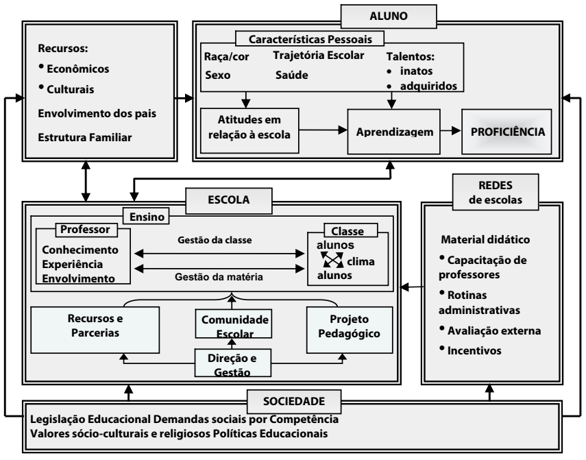
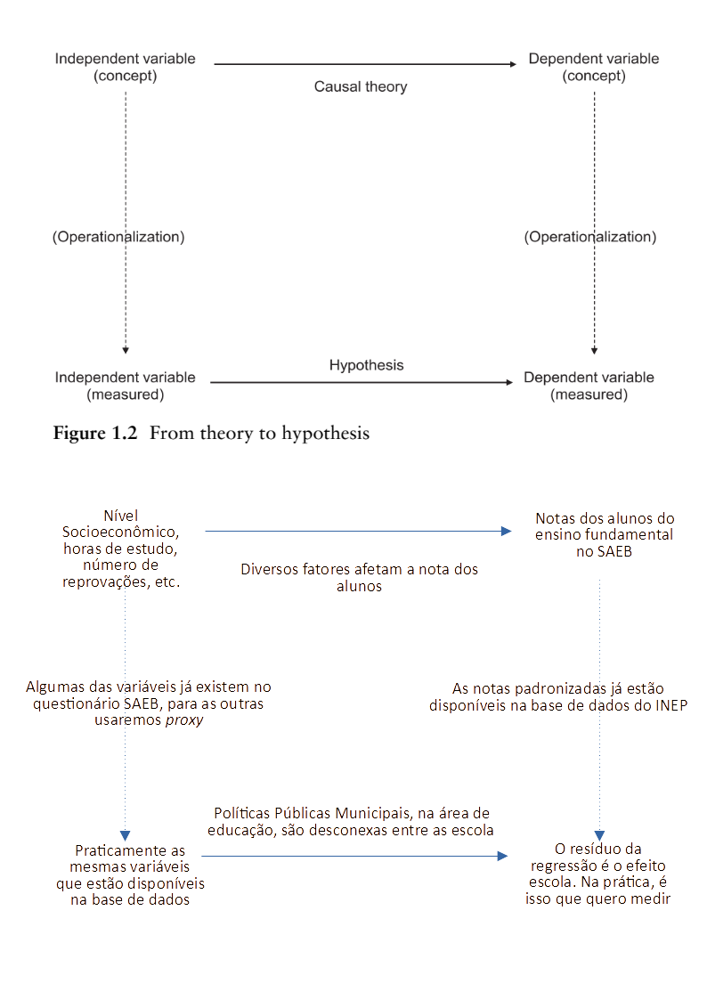
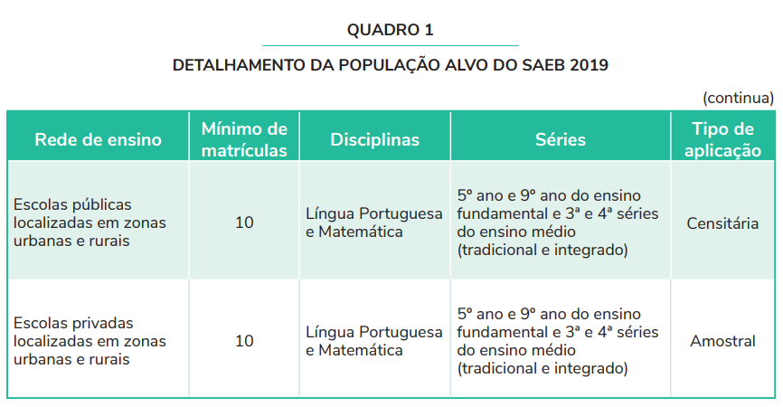
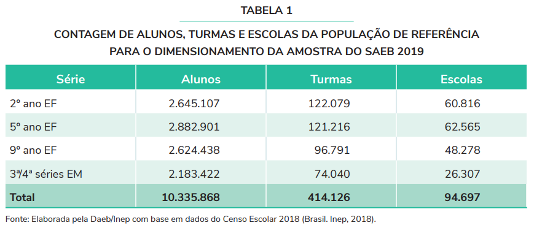
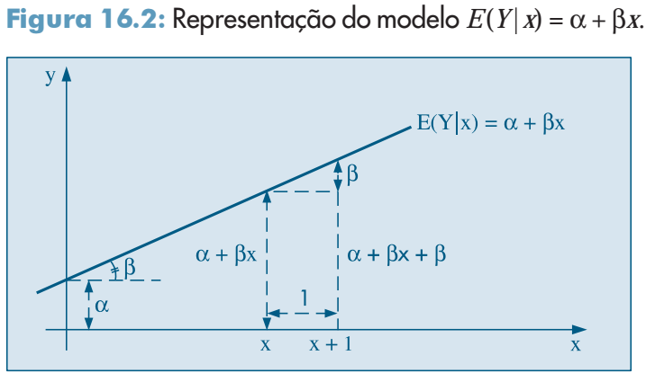

<style>
body {
text-align: justify}
</style>


```{r setup, include=FALSE}
knitr::opts_chunk$set(echo = TRUE, warning = FALSE, message = FALSE)
```

```{r pacotes}
library(tidyverse)
library(stats)  # TukeyHSD
library(lme4)   # Modelos HLM
library(plotly) # Gráficos Interativos
library(scales) # Escalas em Percentual
library(ggpubr) # Múltiplos Gráficos
library(jtools) # summ de regressão HLM
library(sjPlot) # regressão e tab_model
library(RColorBrewer) # Expandir paleta de cores
library(reshape) # comando melt
library(splines) # comando bs
saeb <- as.data.frame(readRDS("saebSTfull.rds")) # Base de dados de Serra Talhada - PE
```

# Roteiro Análise de Dados

## 1) Qual é a questão da pesquisa? Por que ela é interessante e importante? 1) Novo y explicado por x 2) y explicado por novo x 3) novo z que modifica a relacao entre x e y

O que há por trás da desigualdade de desempenho das escolas de nível fundamental no âmbito dos municípios brasileiros? Se a rede municipal está orientada pela mesma política educacional e, em tese, as escolas têm os mesmos recursos disponíveis; o que justifica as diferenças de desempenho nas notas das provas do SAEB (Sistema de Avaliação da Educação Básica) de instituições semelhantes, algumas vezes localizadas no mesmo bairro? Para entender essa questão estamos procurando saber qual o efeito escola, isto é, a parte do desempenho do aluno que não é devida à sua condição socioeconômica e sim ao fato de pertencer a determinada escola. Para entender melhor essa questão imagine dois alunos de condições sociais e de níveis educacionais diferentes. As notas deles no SAEB são diferentes por causa dessas condições mencionadas ou porque a escola fez um bom trabalho pedagógico? A priori, não há como saber; mas se conseguirmos controlar essas condições por aluno é possível isolar o efeito da escola no seu desempenho. É como se o *mesmo aluno* fosse estudar em duas escolas diferentes, aquele com maior nota será devido ao efeito escola e não à sua condição social, etc. Se soubermos o efeito que cada escola exerce, podemos identificar as mais bem sucedidas ainda que a sua nota média no SAEB não seja tão expressiva.

A pesquisa é interessante porque é possível isolar o efeito que a escola promove nos alunos e descobrir qual delas está fazendo um bom trabalho, algo que só a nota média no SAEB não capaz de explicar. A nota média no SAEB é associada a uma variável de fluxo de aprovação de alunos para compor o IDEB (Índice de Desenvolvimento da Educação Básica). Olhando só para o IDEB vemos apenas um ranking com escolas bem ou mal colocadas, mas se olharmos para o efeito escola iremos ver além do IDEB as escolas que tiveram maior participação nas notas dos alunos, tanto positiva quanto negativamente. Escolas com efeito positivo são aquelas que tiveram contribuição favorável nas notas dos alunos, ou seja eles aprenderam alguma coisa estudando naquela instituição. Escolas com efeito negativo não estão agregando conhecimento aos seus alunos. É possível perguntar? Mas como um estabelecimento com efeito escola negativo tem um bom IDEB? Porque os alunos talvez tenham bom *background* familiar, boas condições sociais, etc, ou uma série de fatores que fizeram a nota média da escola subir, mas não porque o ensino da instituição esteja agregando conhecimento aos alunos — pelo contrário — não está!

Não há um novo y explicado por x, nem vice versa, nem um novo z. O que há é uma regressão linear hierárquica (que será explicada mais adiante) onde estamos interessados nos resíduos. Os resíduos são o que não é explicado pelo modelo. Se incluirmos as variáveis socioeconômicas dos alunos e eventualmente outra de controle no nível da escola, boa parte do que sobra só pode ser atribuído a fatores daquela escola epecificamente e que não foram capturados pela regressão, a isso chamamos de efeito escola. Sendo assim, este trabalho é apenas uma forma diferente de utilizar as regressões, onde muitos estão interessados somente nos coeficientes como resultado principal nós estamos interessados nos coeficientes, mas os resíduos são o resultado principal. Eles servem não apenas para validar alguns pressupostos da regressão mas como uma quantidade da influência de cada escola. 


## 2) Qual é a teoria?

A teoria são os modelos lineares hierárquicos, também conhecidos como multinível ou *linear mixed models*. Esse modelos levam em conta a hierarquia no agrupamento dos dados. A escola é um exemplo típico desses casos. Os alunos estão agrupados nas turmas, as turmas nas escolas, as escolas nos municípios, e assim sucessivamente. Teoricamente podemos ter vários níveis mas as estimações dos coeficientes vão se tornando mais complexas e de difícil interpretação. Vejamos os gráficos abaixo para uma regressão das notas de português e matemática em função das horas de estudo e das reprovações. A linha magenta é a reta de regressão geral com todas as notas dos alunos sem separação por escola. As linhas azuis são as regressões ajustadas por escola. Note que os interceptos e as inclinações são, em alguns casos, bem diferentes da reta geral.

```{r retas de regressao, fig.width = 8.5}
r1 <- saeb %>%
           ggplot(aes(x = hora, y = port, group = escola)) +
           geom_smooth(color = "deepskyblue", size = .5, se = F, formula = y ~ x, method = "lm") +
           geom_smooth(aes(group = 1), color = "darkmagenta", size = 2, se = F, formula = y ~ x, method = "lm")
           
r2 <- saeb %>%
           ggplot(aes(x = rep, y = port, group = escola)) +
           geom_smooth(color = "deepskyblue", size = .5, se = F, formula = y ~ x, method = "lm") +
           geom_smooth(aes(group = 1), color = "darkmagenta", size = 2, se = F, formula = y ~ x, method = "lm")

r3 <- saeb %>%
           ggplot(aes(x = hora, y = mat, group = escola)) +
           geom_smooth(color = "deepskyblue", size = .5, se = F, formula = y ~ x, method = "lm") +
           geom_smooth(aes(group = 1), color = "darkmagenta", size = 2, se = F, formula = y ~ x, method = "lm")
           
r4 <- saeb %>%
           ggplot(aes(x = rep, y = mat, group = escola)) +
           geom_smooth(color = "deepskyblue", size = .5, se = F, formula = y ~ x, method = "lm") +
           geom_smooth(aes(group = 1), color = "darkmagenta", size = 2, se = F, formula = y ~ x, method = "lm")
           
ggarrange(r1, r2, r3, r4, ncol = 2, nrow = 2)
```


Utilizar os modelos multinível captura essa variação tanto de intercepto quanto de inclinação. O texto abaixo segue [@Goldstein2010].

O modelo de regressão linear padrão é dado por $y_i = \alpha + \beta x_i + e_i$ onde o índice $i$ representa os estudantes, $\alpha$ o intercepto,  $\beta$ a inclinação da reta e $e_i$ os resíduos, $e_i \mathtt\sim N(0, \sigma_e^2)$. O modelo para cada escola $j$ é dado por $$y_{ij} = \alpha_j + \beta_j x_{ij} + e_{ij}$$ com $e_{ij} \mathtt\sim N(0, \sigma_e^2)$.

Esse modelo ainda é o padrão, mas agrupado por escola. Para torná-lo um modelo multinível devemos transformar os coeficientes $\alpha_j$ e $\beta_j$ em variáveis aleatórias. Por uma questão de consistência de notação iremos trocar $\alpha_j$ por $\beta_{0j}$ e $\beta_j$ por $\beta_{1j}$ e reescrever $$\beta_{0j} = \beta_0 + u_{0j}$$ $$\beta_{1j} = \beta_1 + u_{1j}$$

onde $u_{0j}$ e $u_{1j}$ agora são variáveis aleatórias com parâmetros: $$\mathrm{E}(u_{0j}) = \mathrm{E}(u_{1j}) = 0$$ $$\mathrm{var}(u_{0j}) = \sigma_{u0}^2 \text{, } \mathrm{var}(u_{1j}) = \sigma_{u1}^2 \text{, } \mathrm{cov}(u_{0j}, u_{1j}) = \sigma_{u01}$$

Vale salientar que algumas funções de tabelas de regressão como o `tab_model` do pactote `sjPlot` utilizam outra notação. No nosso caso $\sigma_{u0}^2$ está representado na tabela como $\tau_{00}$ (ver seção 8). Substituindo no nosso modelo padrão $$y_{ij} = \alpha_j + \beta_j x_{ij} + e_{ij}$$ obtemos

$$y_{ij} = \beta_0 + \beta_1x_{ij} + (u_{0j} + u_{1j}x_{ij} + e_{0ij}) \text{, } \mathrm{var}(e_{0ij}) = \sigma_{e0}^2$$

A parte que está entre parêntesis chamamos de efeitos aleatórios e a parte que não está entre parêntesis chamamos de efeitos fixos. A estimação do modelo é feita pelo método REML (*Restricted Maximum Likelihood*) com o auxílio do pacote `lme4` do R. Como dito anteriormente estamos interessados, além dos coeficientes e seus sinais, nos resíduos. Na equação anterior $u_{0j}$ é o termo aleatório associado à escola $j$, ou o efeito escola associado à escola $j$. 

## 3) Elaborar uma explicação causal teórica

Como medir o desempenho dos alunos e de que forma é possível avaliar a qualidade do ensino público? Desde a década de 1930 há um movimento para se avaliar de forma ampla a educação brasileira, mas apenas em meados da década de 1990 um sistema foi implantado de fato, o SAEB (Sistema de Avaliação da Educação Básica), com base em resultados quantitativos [@Azevedo2000] *apud* [@Coelho2008]. Segundo a autora surgem, da pesquisa em modelos de avaliação com vistas à definição de prioridades e melhoria da qualidade da educação, basicamente dois modelos: o primeiro dá prioridade às condições nas quais o ensino é oferecido, a formação dos professores e suas condições de trabalho, currículo, cultura e organização do ambiente escolar numa perspectiva mais qualitativa voltada ao processo que gera os resultados. O segundo é mais voltado para a avaliação em larga escala e em testes padronizados, numa abordagem mais quantitativa e focada nos resultados finais. Essa abordagem mais quantitativa deu início a pesquisas voltadas para a descoberta dos fatores que diferenciavam as escolas e tornavam umas mais eficazes que outras. 

Muito tem-se discutido a respeito dos fatores associados ao desempenho das escolas. Este trabalho segue um padrão já estabelecido na literatura [@Soares2002], [@Barros2001], [@Filho2007], [@Gremaud2007], onde os atores envolvidos, a saber secretários de educação, legisladores e diretores de escola, têm pouco controle sobre o contexto social vivenciado pelos alunos fora do ambiente escolar. Uma possível categorização das variáveis que influenciam o desempenho dos alunos pode, então, ser reduzida a três grupos: a origem familiar e as variáveis individuais de cada aluno; o contexto socioeconômico da escola; e as práticas e insumos pedagógicos da mesma [@Soares2002]. A figura abaixo ajuda a entender essas variáveis de forma esquemática. 




Os fatores que afetam os alunos e que fazem parte do interesse deste trabalho pertecem à dimensão da Escola ou, no máximo, à dimensão da Rede de Escolas. 

### 3.1) Qual é a variável dependente?

É a proficiência (variável contínua), dada pelas notas de Português e Matemática dos alunos do 9º ano do ensino fundamental do município de Serra Talhada para o ano de 2019. Foram selecionadas apenas escolas com turmas de 20 alunos ou mais que responderam às provas e os questionários do SAEB. No gráfico abaixo vemos as notas médias por escola:

```{r notas do saeb, fig.width = 8.5}
#--------------------------------------------------------------------------------  
# Plotando Notas no Saeb 2019
#-------------------------------------------------------------------------------- 

saeb_bar <- saeb %>%
  group_by(escola) %>%
  dplyr::summarize(portugues = mean(port), matematica = mean(mat)) %>% 
  select(escola, portugues, matematica) %>% 
  as.data.frame() %>% 
  dplyr::ungroup()

saeb_bar <- gather(saeb_bar, materia, nota, portugues:matematica)

ggplot(saeb_bar, aes(x = escola, weight = nota, fill = materia)) +
  geom_bar(position = 'dodge') +
  coord_flip() +
  scale_fill_manual(values = c("deepskyblue3", "aquamarine3")) +
  labs(title = "Notas no Saeb 2019 - por Escola", x = "Escola", y = "Nota", color = "Matéria") +
  theme(legend.position = "right")
```  


No total foram `r nrow(saeb)` alunos distribuídos em `r length(unique(saeb$escola))` escolas. Os dados podem ser obtidos no site do INEP (https://download.inep.gov.br/microdados/microdados_saeb_2019.zip), mas cabe ressaltar que as varáveis com *missing*, `NA` ou Não Informado foram imputadas aleatoriamente por *hot deck* com o pacote `Hmisc`. Queremos explicar os valores obtidos nas notas através de horas de estudo, reprovação e algumas variáveis de controle com o intuito de observar os resíduos e estabelecer o efeito escola. Esta análise quantitativa pode ensejar uma investigação mais apurada sobre as políticas públicas municipais, principalmente no que tange a questão das desigualdades educacionais.

### 3.2) Qual é a variável independente? 

As variáveis que compõe a nossa base de dados são: Escolas, Alunos, Turno, Notas de Português e Matemática, Indicador de Nível Sócio Econômico (INSE), Horas de Estudo, Quantidade de Reprovações, Raça, Escolaridade da Mãe, Escolaridade do Pai e Posse de Automóveis como *proxy* da renda, Local da Escola e Dependência Administrativa. Vale salientar que nem todas entraram no modelo ajustado de regressão. Vejamos a base de dados:

```{r visualizando dados}
#--------------------------------------------------------------------------------
# Visualizando Base de Dados
#--------------------------------------------------------------------------------
glimpse(saeb)
```


### 3.3) Qual é a teoria causal que conecta a variável independente à variável dependente?

É a teoria que estuda os fatores determinantes do desempenho escolar. De acordo com a literatura [@Soares2002], [@Barros2001], [@Filho2007], [@Gremaud2007], [@Laros2012], os fatores jã são bem conhecidos e estabelecidos conforme mencionei na explicação causal teórica. Alguns dos autores citados usam outras variáveis além das que eu usei neste trabalho, mas a título de simplificação não irei replicar tais artigos e sim tentar rodar meu modelo com uma quantidade menor de variáveis.

### 3.4) Por que é importante utilizar as outras variáveis independentes para avaliar essa causalidade e relação entre variáveis?

É muito difícil estabelecer causalidade, principalmente em ciências humanas e ainda mais em estudos observacionais. O que iremos fazer é esboçar alguns possíveis fatores associados. Esqueçamos, por enquanto, essa quimera chamada "causa". De acordo com @Dalson2011, pg. 70. 

>Como dados observacionais não nos permitem observar a operação de tratamentos aleatórios, é impossível tirar conclusões causais usando o desenho de pesquisa discutido aqui. O melhor que nós podemos realizar é incluir as variáveis de controle relevantes no modelo de forma a capturar a relação explicitada acima. Quando a idéia do controle foi introduzida nos modelos de regressão múltipla o objetivo era exatamente emular um experimento usando dados observacionais.

Incluir variáveis de controle é importante, mas não podemos fazer isso baseados apenas em questões puramente estatísticas, como a significância, por exemplo. De acordo com Judea Pearl [@Pearl2013] "*sem saber a estrutura do problema, não é possível determinar quais variáveis devem ser incluídas*". Ela menciona o paradoxo de Simpson que diz respeito a como a relação *causal* entre as variáveis $x$ e $y$ é afetada pela inclusão de uma terceira variável $z$. Uma máquina de fabricar paradoxo de Simpson, inclusive com gerador de código em R pode ser visto aqui (http://dagitty.net/learn/simpson/). Dessa forma, é preciso ter uma justificativa substantiva (e não apenas puramente estatística) da inclusão de variáveis de controle no modelo. Caso estas variáveis sejam retiradas é possível haver viés de variável omitida ou covariância espúria entre a variável dependente e alguma variável independente, ver @Ferrao2018, pg. 281. 

## 4) Operacionalização dos conceitos teóricos em variáveis empíricas

### 4.1) Confiabilidade e Validade

De acordo com @Karino2014, pg. 274.

>Há pouca literatura acerca do que se pretende medir por meio dos questionários do Saeb e o que realmente eles estão medindo.  Na  maior  parte  das  vezes,  há  informações  gerais  sobre o que os questionários buscam identificar: fatores contextuais; nível socioeconômico; aspectos culturais; etc. Todavia, verifica-se carência de uma definição clara e objetiva de cada um desses fatores, uma vez que eles podem representar uma série de informações. Há uma carência ainda maior de estudos que apresentem evidências de validade desses questionários.

Os autores fazem um estudo de como os questionários do SAEB podem melhorar sua confiabilidade e validade na confecção de  construtos de interesse dos pesquisadores. No sentido de validade, tanto interna quanto externa, como abordado em [@Kellstedt2018] os dados do SAEB são os únicos produzidos em larga escala com abrangência em todo território nacional e servem de base para inúmeros estudos sobre os fatores que influenciam o desempenho dos alunos. Acredito que eles são válidos mais por conta do grande número de participantes do SAEB e portanto uma grande amostra de conveniência do que por contrutos bem construídos. O questionário do SAEB padece de todos os problemas de viés com qualquer outro *survey*. Como avaliado por @Karino2014 ainda há espaço para melhorar o questionário. Um exemplo de confiabilidade questionável, a meu ver, se dá quando crianças do 5º ano do ensino fundamental não têm, talvez, informações suficientes sobre características dos seus pais. Para ser ter uma ideia, neste trabalho — conduzido com alunos do 9º ano e portanto mais velhos — quase metade dos respondentes não sabia qual a escolaridade dos pais.  

### 4.2) Qual seria a forma ideal de medir essas variáveis?

A maneira ideal de se medir o efeito escola seria através de uma seleção aleatória dos alunos que irão frequentar determinada escola, bem como acompanhar cada aluno em sua trajetória escolar durante alguns anos. Um estudo com dados longitudinais fornecem o valor adicionado da escola (similar ao efeito escola), enquanto os estudos transversais, como o deste trabalho, são chamados de análise contextualizada. A variável que mais contribui para o sucesso acadêmico dos alunos é o conhecimento prévio [@Ferrao2018], pg.288. Infelizmente não há base de dados longitudinal disponível no Brasil para um estudo mais aprofundado. Outra forma de obter uma variável que melhor represente o nível socioeconômico do aluno, neste trabalho dado por escolaridade do pai e posse de automóveis, é utilizar análise de componentes principais para extrair mais informações dos questionários do SAEB [@Laros2012]. Esta recomendação pode ser implementada em trabalhos futuros. 


## 5) Elaborar hipóteses

As hipóteses básicas do modelo são de que horas de estudo e número de reprovações são positivamente e negativamente relacionadas com as notas, respectivamente, tanto de Português quanto de Matemática. Outras hipóteses também são avaliadas como a escolaridade da mãe. Quanto maior a escolaridade da mãe maior a nota em ambas as provas. O mesmo acontece com a escolaridade do pai e com a posse de automóveis pois são *proxy* para a renda do aluno. Acontece que nem sempre o sinal *respeita* nossas expectativas. Como as variáveis são, em muitos casos, categóricas, o sinal é positivo para uns itens e negativo para outros. Por exemplo, a variável horas de estudo. Quanto mais horas o aluno estuda maior sua nota, mas as notas caem quando o aluno estuda mais de 2h por dia. Efeito semelhante acontece em outras variáveis como escolaridade da mãe. Era de se esperar que as notas dos alunos cujas mães têm nível superior fosse maior, mas isso não acontece. Talvez por que essas mães não tenham tempo de acompanhar as tarefas de seus filhos, não sabemos ao certo.

### 5.1) O que você espera observar caso a teoria esteja certa. Estabelecer o tipo de relação esperada teoricamente entre as variáveis operacionalizadas

O que a Teoria preconiza é que quanto mais horas de estudo maior a nota, quanto menos reprovações maior a nota,  assim como a importância de um ambiente escolar e familiar favoráveis. Escolas mais bem equipadas (variável não incluída neste trabalho) possuem alunos com melhores notas, lares estáveis e pais com boa formação acadêmica são fatores positivos. Os colegas também influenciam uns aos outros. No âmbito deste trabalho, podemos dividir nossa expectativa entre variáveis que influenciam positiva e negativamente as proficiências em Português e Matemática como segue:

### <span style = "color: blue;">1. Positiva</span> 

Indicador de Nível Sócio Econômico (INSE), Horas de Estudo, Escolaridade da Mãe e do Pai, Posse de Automóveis

### <span style = "color: red;">2. Negativa</span> 

Quantidade de Reprovações

## 6) Fazer um esquema semelhante à figura 1.2 do livro (página 10)




## 7) Descrição dos dados

- `port:` Nota de Português. Variável contínua;
- `mat:` Nota de Matemática. Variável contínua;
- `inse:` Indicador de Nível Socioeconômico. Variável contínua;
- `hora:` Quantidade de horas de estudo por dia após o horário da aula, exceto nos fim de semana. Variável ordinal (categórica). Pode assumir valores de 0h por dia, entre 0h e 1h por dia, de 1h a 2h por dia e mais de 2h por dia;
- `rep:` Número de reprovações. Variável ordinal (categórica). Pode assumir valores de 0, 1 ou 2 ou mais reprovações. Colocada desta forma a variável deixa de ser discreta e passa a ser ordinal;
- `raca:` Raça. Variável ordinal. Pode assumir valores como: Parda, Branca, Indígena, Preta, Amarela;
- `escmae:` Escolaridade da mãe. Variável ordinal. Pode assumir valores como abaixo do 5º ano fundamental, 5º ano do fundamental, Fundamental Completo, Médio Completo, Superior Completo;
- `escpai:` Escolaridade do pai. Variável ordinal. Pode assumir valores como abaixo do 5º ano fundamental, 5º ano do fundamental, Fundamental Completo, Médio Completo, Superior Completo;
- `carro:` Quantidade de carros na família. Variável ordinal. Pode assumir valores: 0, 1, 2 ou 3 ou mais. Com esta variável, acontece a mesma coisa que com `rep`. Se não fosse essa opção de 3 ou mais carros, a variável poderia ser discreta;
- `local:` Variável nominal. Pode assumir valores Urbana ou Rural;
- `dependencia:` Variável nominal. Pode assumir valores Estadual, Municipal ou Federal;
- `ideb2019:` Variável contínua que consta na base apenas por motivo de comparação com o efeito escola.

### 7.1) Dimensão temporal e espacial

A base é *cross section* para o ano de 2019 e abrange todos os municípios brasileiros com escolas públicas que atendem aos critério mencionados no item seguinte. 

### 7.2) Considerações sobre a amostra

De acordo com o Relatório de Amostragem do Saeb 2019 [@Inep2019], a base dos alunos das escolas públicas é censitária e composta por 

>todos os alunos de turmas regulares matriculados em 2019 nas escolas do Censo Escolar 2018, nas localizações urbanas e rurais, em uma das séries de interesse, excluindo os alunos das escolas com menos de dez alunos por série e outros critérios específicos

O Quadro 1 e a Tabela 1 resumem a metodologia. Ainda há notas de Ciências Humanas e da Natureza, mas os alunos das escolas públicas que respondem tais provas são escolhidos por amostragem e não de forma censitária como no caso das provas de Português e Matemática. Ainda segundo o relatório, para delimitação da população de referência, a Portaria nº 366/2019 considerou as seguintes exclusões:

1. As escolas com menos de dez estudantes matriculados nas etapas avaliadas;
2. As turmas multisseriadas;
3. As turmas de correção de fluxo;
4. As turmas de educação de jovens e adultos;
5. As turmas de ensino médio normal/magistério;
6. As classes, as escolas ou os serviços especializados de educação especial não integrantes do ensino regular; e
7. As escolas indígenas que não ministrem a Língua Portuguesa como primeira língua.  





### 7.3) Que tipo de variável você usa?

A variável dependente é contínua. A proficiência em Português pode assumir valores de `r min(saeb$port)` até `r max(saeb$port)`. A proficiência em Matemática também. Ela varia de `r min(saeb$mat)` a `r max(saeb$mat)`.

### 7.4) Gráficos e teste adequados para descrever cada uma das variáveis

```{r TukeyHSD Port, fig.width = 10, fig.height = 21}
par(mfrow=c(3,2), oma = c(0,0,2,0))
port_anova <- aov(port ~ hora + rep + raca + escmae + escpai + carro, data = saeb)
port_hsd <- TukeyHSD(port_anova)
plot(port_hsd)
mtext("TukeyHSD: port ~ hora + rep + raca + escmae + escpai + carro", line = 0, side = 3, outer = TRUE)
par(mfrow=c(1,1))
```

```{r TukeyHSD Mat, fig.width = 10, fig.height = 21}
par(mfrow=c(3,2), oma = c(0,0,2,0))
mat_anova <- aov(mat ~ hora + rep + raca + escmae + escpai + carro, data = saeb)
mat_hsd <- TukeyHSD(mat_anova)
plot(mat_hsd)
mtext("TukeyHSD: mat ~ hora + rep + raca + escmae + escpai + carro", line = 0, side = 3, outer = TRUE)
par(mfrow=c(1,1))
```

```{r graficos de barra, fig.width = 10, fig.height = 10}
#--------------------------------------------------------------------------------
# Barplot da base de dados
#--------------------------------------------------------------------------------
# Primeira parte
#
p1 <- saeb %>%
  ggplot(aes(x = raca)) +
  geom_bar(aes(y = (..count..)/sum(..count..), fill = raca)) +
  geom_text(aes(y = ((..count..)/sum(..count..)), label = scales::percent((..count..)/sum(..count..))), stat = "count", vjust = -0.5) +
  scale_y_continuous(labels = percent) +
  labs(title = "Raça") +
  theme(axis.text.y = element_blank(),
        axis.ticks = element_blank(),
        legend.position = "none",
        axis.title.x = element_blank(),
        axis.title.y = element_blank()) +
  scale_fill_brewer(palette = "BuPu")
#--------------------------------------------------------------------------------
p2 <- saeb %>%
  ggplot(aes(x = escmae)) +
  geom_bar(aes(y = (..count..)/sum(..count..), fill = escmae)) +
  geom_text(aes(y = ((..count..)/sum(..count..)), label = scales::percent((..count..)/sum(..count..))), stat = "count", vjust = -0.5) +
  scale_y_continuous(labels = percent) +
  labs(title = "Escolaridade da Mãe") +
  theme(axis.text.y = element_blank(),
        axis.ticks = element_blank(),
        legend.position = "none",
        axis.title.x = element_blank(),
        axis.title.y = element_blank()) +
  scale_fill_brewer(palette = "BuPu")
#--------------------------------------------------------------------------------
p3 <- saeb %>%
  ggplot(aes(x = escpai)) +
  geom_bar(aes(y = (..count..)/sum(..count..), fill = escpai)) +
  geom_text(aes(y = ((..count..)/sum(..count..)), label = scales::percent((..count..)/sum(..count..))), stat = "count", vjust = -0.5) +
  scale_y_continuous(labels = percent) +
  labs(title = "Escolaridade do Pai") +
  theme(axis.text.y = element_blank(),
        axis.ticks = element_blank(),
        legend.position = "none",
        axis.title.x = element_blank(),
        axis.title.y = element_blank()) +
  scale_fill_brewer(palette = "BuPu")
#--------------------------------------------------------------------------------
p4 <- saeb %>%
  ggplot(aes(x = carro)) +
  geom_bar(aes(y = (..count..)/sum(..count..), fill = carro)) +
  geom_text(aes(y = ((..count..)/sum(..count..)), label = scales::percent((..count..)/sum(..count..))), stat = "count", vjust = -0.5) +
  scale_y_continuous(labels = percent) +
  labs(title = "Possui Carro?") +
  theme(axis.text.y = element_blank(),
        axis.ticks = element_blank(),
        legend.position = "none",
        axis.title.x = element_blank(),
        axis.title.y = element_blank()) +
  scale_fill_brewer(palette = "BuPu")

ggarrange(p1, p2, p3, p4, ncol = 2, nrow = 2)

#--------------------------------------------------------------------------------
# Barplot da base de dados
#--------------------------------------------------------------------------------
# Segunda parte
#
p5 <- saeb %>%
  ggplot(aes(x = hora)) +
  geom_bar(aes(y = (..count..)/sum(..count..), fill = hora)) +
  geom_text(aes(y = ((..count..)/sum(..count..)), label = scales::percent((..count..)/sum(..count..))), stat = "count", vjust = -0.5) +
  scale_y_continuous(labels = percent) +
  labs(title = "Quantas Horas de Estudo após as Aulas") +
  theme(axis.text.y = element_blank(),
        axis.ticks = element_blank(),
        legend.position = "none",
        axis.title.x = element_blank(),
        axis.title.y = element_blank()) +
  scale_fill_brewer(palette = "BuPu")
#--------------------------------------------------------------------------------
p6 <- saeb %>%
  ggplot(aes(x = rep)) +
  geom_bar(aes(y = (..count..)/sum(..count..), fill = rep)) +
  geom_text(aes(y = ((..count..)/sum(..count..)), label = scales::percent((..count..)/sum(..count..))), stat = "count", vjust = -0.5) +
  scale_y_continuous(labels = percent) +
  labs(title = "Quantas Reprovações") +
  theme(axis.text.y = element_blank(),
        axis.ticks = element_blank(),
        legend.position = "none",
        axis.title.x = element_blank(),
        axis.title.y = element_blank()) +
  scale_fill_brewer(palette = "BuPu")
#--------------------------------------------------------------------------------
p7 <- saeb %>%
  ggplot(aes(x = local)) +
  geom_bar(aes(y = (..count..)/sum(..count..), fill = local)) +
  geom_text(aes(y = ((..count..)/sum(..count..)), label = scales::percent((..count..)/sum(..count..))), stat = "count", vjust = -0.5) +
  scale_y_continuous(labels = percent) +
  labs(title = "Local da Escola") +
  theme(axis.text.y = element_blank(),
        axis.ticks = element_blank(),
        legend.position = "none",
        axis.title.x = element_blank(),
        axis.title.y = element_blank()) +
  scale_fill_brewer(palette = "BuPu")
#--------------------------------------------------------------------------------
p8 <- saeb %>%
  ggplot(aes(x = dependencia)) +
  geom_bar(aes(y = (..count..)/sum(..count..), fill = dependencia)) +
  geom_text(aes(y = ((..count..)/sum(..count..)), label = scales::percent((..count..)/sum(..count..))), stat = "count", vjust = -0.5) +
  scale_y_continuous(labels = percent) +
  labs(title = "Dependência Administrativa") +
  theme(axis.text.y = element_blank(),
        axis.ticks = element_blank(),
        legend.position = "none",
        axis.title.x = element_blank(),
        axis.title.y = element_blank()) +
  scale_fill_brewer(palette = "BuPu")

ggarrange(p5, p6, p7, p8, ncol = 2, nrow = 2)
```


```{r violin plot 1, fig.width = 8.5, fig.height = 16}
q1p <- saeb %>%
  ggplot(aes(x = hora, y = port, fill = hora)) +
  geom_violin() +
  geom_boxplot(width = 0.3) +
  xlab("Horas de Estudo") +
  ylab("") +
  theme(legend.position="none") +
  scale_fill_brewer(palette = "BuPu")

q2p <- saeb %>%
  ggplot(aes(x = rep, y = port, fill = rep)) +
  geom_violin() +
  geom_boxplot(width = 0.3) +
  xlab("Reprovações") +
  ylab("") +
  theme(legend.position="none") +
  scale_fill_brewer(palette = "BuPu")

q3p <- saeb %>%
  ggplot(aes(x = raca, y = port, fill = raca)) +
  geom_violin() +
  geom_boxplot(width = 0.3) +
  xlab("Raça") +
  ylab("") +
  theme(legend.position="none") +
  scale_fill_brewer(palette = "BuPu")

q4p <- saeb %>%
  ggplot(aes(x = escmae, y = port, fill = escmae)) +
  geom_violin() +
  geom_boxplot(width = 0.3) +
  xlab("Escolaridade da Mãe") +
  ylab("") +
  theme(legend.position="none") +
  scale_fill_brewer(palette = "BuPu")

q5p <- saeb %>%
  ggplot(aes(x = escpai, y = port, fill = escpai)) +
  geom_violin() +
  geom_boxplot(width = 0.3) +
  xlab("Escolaridade do Pai") +
  ylab("") +
  theme(legend.position="none") +
  scale_fill_brewer(palette = "BuPu")

q6p <- saeb %>%
  ggplot(aes(x = carro, y = port, fill = carro)) +
  geom_violin() +
  geom_boxplot(width = 0.3) +
  xlab("Possui Carro?") +
  ylab("") +
  theme(legend.position="none") +
  scale_fill_brewer(palette = "BuPu")

q7p <- saeb %>%
  ggplot(aes(x = local, y = port, fill = local)) +
  geom_violin() +
  geom_boxplot(width = 0.3) +
  xlab("Local") +
  ylab("") +
  theme(legend.position="none") +
  scale_fill_brewer(palette = "BuPu")

q8p <-saeb %>%
  ggplot(aes(x = dependencia, y = port, fill = dependencia)) +
  geom_violin() +
  geom_boxplot(width = 0.3) +
  xlab("Dependência Administrativa") +
  ylab("") +
  theme(legend.position="none") +
  scale_fill_brewer(palette = "BuPu")

q18p <- ggarrange(q1p, q2p, q3p, q4p, q5p, q6p, q7p, q8p, ncol = 2, nrow = 4)
annotate_figure(q18p, top = text_grob("Notas de Português por Categoria", color = "black", size = 14))
```

```{r violin plot 2, fig.width = 8.5, fig.height = 16}
q1m <- saeb %>%
  ggplot(aes(x = hora, y = mat, fill = hora)) +
  geom_violin() +
  geom_boxplot(width = 0.3) +
  xlab("Horas de Estudo") +
  ylab("") +
  theme(legend.position="none") +
  scale_fill_brewer(palette = "BuPu")

q2m <- saeb %>%
  ggplot(aes(x = rep, y = mat, fill = rep)) +
  geom_violin() +
  geom_boxplot(width = 0.3) +
  xlab("Reprovações") +
  ylab("") +
  theme(legend.position="none") +
  scale_fill_brewer(palette = "BuPu")

q3m <- saeb %>%
  ggplot(aes(x = raca, y = mat, fill = raca)) +
  geom_violin() +
  geom_boxplot(width = 0.3) +
  xlab("Raça") +
  ylab("") +
  theme(legend.position="none") +
  scale_fill_brewer(palette = "BuPu")

q4m <- saeb %>%
  ggplot(aes(x = escmae, y = mat, fill = escmae)) +
  geom_violin() +
  geom_boxplot(width = 0.3) +
  xlab("Escolaridade da Mãe") +
  ylab("") +
  theme(legend.position="none") +
  scale_fill_brewer(palette = "BuPu")

q5m <- saeb %>%
  ggplot(aes(x = escpai, y = mat, fill = escpai)) +
  geom_violin() +
  geom_boxplot(width = 0.3) +
  xlab("Escolaridade do Pai") +
  ylab("") +
  theme(legend.position="none") +
  scale_fill_brewer(palette = "BuPu")

q6m <- saeb %>%
  ggplot(aes(x = carro, y = mat, fill = carro)) +
  geom_violin() +
  geom_boxplot(width = 0.3) +
  xlab("Possui Carro?") +
  ylab("") +
  theme(legend.position="none") +
  scale_fill_brewer(palette = "BuPu")

q7m <- saeb %>%
  ggplot(aes(x = local, y = mat, fill = local)) +
  geom_violin() +
  geom_boxplot(width = 0.3) +
  xlab("Local") +
  ylab("") +
  theme(legend.position="none") +
  scale_fill_brewer(palette = "BuPu")

q8m <-saeb %>%
  ggplot(aes(x = dependencia, y = mat, fill = dependencia)) +
  geom_violin() +
  geom_boxplot(width = 0.3) +
  xlab("Dependência Administrativa") +
  ylab("") +
  theme(legend.position="none") +
  scale_fill_brewer(palette = "BuPu")

q18m <- ggarrange(q1m, q2m, q3m, q4m, q5m, q6m, q7m, q8m, ncol = 2, nrow = 4)
annotate_figure(q18m, top = text_grob("Notas de Matemática por Categoria", color = "black", size = 14))
```

### 7.5) Gráficos e testes adequados para descrever a associação entre as variáveis

```{r boxplots, fig.width = 8.5}
# Palette BuPu com as cores da escola
newBuPu <- colorRampPalette(brewer.pal(7, "BuPu"))(length(unique(saeb$escola)))

saeb %>%
  group_by(escola) %>%
  ggplot(aes(x = escola, y = port, fill = escola)) +
  geom_boxplot() +
  xlab("Horas de Estudo") +
  ylab("") +
  coord_flip() +
  ggtitle("Notas Médias de Português por Escola") +
  theme(legend.position="none",
      axis.text.x = element_blank(),
      axis.title.x = element_blank(),
      axis.title.y = element_blank()) +
  scale_fill_manual(values = newBuPu)
    
saeb %>%
  group_by(escola) %>%
  ggplot(aes(x = escola, y = mat, fill = escola)) +
  geom_boxplot() +
  xlab("Horas de Estudo") +
  ylab("") +
  coord_flip() +
  ggtitle("Notas Médias de Matemática por Escola") +
  theme(legend.position="none",
      axis.text.x = element_blank(),
      axis.title.x = element_blank(),
      axis.title.y = element_blank()) +
  scale_fill_manual(values = newBuPu)
```

```{r notas versus inse, fig.width = 8.5}
v1 <- saeb %>%
  ggplot(aes(x = inse, y = port)) +
  geom_point() +
  geom_smooth(formula = y ~ x, method = lm)

v2 <- saeb %>%
  ggplot(aes(x = inse, y = mat)) +
  geom_point() +
  geom_smooth(formula = y ~ x, method = lm)

v12 <- ggarrange(v1, v2, ncol = 2, nrow = 1)
annotate_figure(v12, top = text_grob("Notas de Português e Matemática por Nível Socioeconômico", color = "black", size = 14))
```


## 8) Regressão (linear ou logística)

### 8.1) O que é

Neste trabalho iremos utilizar a regressão linear múltipla hierárquica. Conforme já relatado no item 2) sobre a teoria, trata-se de uma regressão linear múltipla convencional mas com os coeficientes linear e angular da reta podendo ser variáveis aleatórias.

### 8.2) Para que serve

A utilidade é a mesma da regressão convencional, mas com a vantagem de reduzir o erro padrão ao tomar as proficiências por escola e não ignorando o fator agrupamento. Além da usual interpretação dos coeficientes e seus sinais os resíduos de nível 2 (nível da escola, no caso deste trabalho. Nível 1 são os alunos) são úteis para entender o quanto da variação das notas pertence a fatores idiosincráticos da cada escola, e portanto revelar o efeito escola.

### 8.3) Pressupostos

De acordo com [@Dalson2011] os pressupostos básicos da regressão podem ser descritos em:

>1. A relação entre a variável dependente e as variáveis independentes deve ser
linear;
2. As variáveis foram medidas adequadamente, ou seja, assume-se que não há erro sistemático de mensuração;
3. A média do termo de erro é igual a zero;
4. Homocedasticidade, ou seja, a variância do termo de erro é constante para os diferentes valores da variável
independente;
5. Ausência de autocorrelação, ou seja, os termos de erros são independentes entre si;
6. A variável independente não deve ser correlacionada com o termo de erro;
7. Nenhuma variável teoricamente relevante para explicar Y foi deixada de fora do modelo e nenhuma variável irrelevante para explicar Y foi incluída no modelo;
8. As variáveis independentes não apresentam alta correlação, o chamado pressuposto da não multicolinearidade;
9. Assume-se que o termo de erro tem uma distribuição normal;
10. Há uma adequada proporção entre o número de casos e o número de parâmetros estimados.


### 8.4) o que são cada um deles e como podem impactar o resultado

Há uma confusão terrível com relação ao termo linear que não dá mais para consertar. Ficou consagrado que se o gráfico de uma função é uma linha reta então a função é chamada de linear. Tecnicamente isso não está de acordo com a definição de *linear* em Matemática. Linearidade é uma propriedade das funções, e muitas coisas cabem na definição de função; de matrizes e determinantes a derivadas e integrais (tecnicamente um funcional).

Uma função $f$ é linear se e somente se: $f(x + y) = f(x) + f(y)$ e $f(kx) = kf(x),~~\forall k\in \mathbb{R}$. A reta de regressão, por conta da existência do intercepto (coeficiente linear não nulo), é uma função afim e não linear. O próprio Gujarati [@Gujarati2011] pg. 451, afirma que o pressuposto de linearidade diz respeito aos parâmetros. Acho que fica pior ainda, pois uma equação do tipo $\alpha + \beta x + \gamma x^2$ é linear nos parâmetros, mas não na variável. Vamos deixar claro que a linearidade aqui é no sentido de regressão e ela quer dizer que o gráfico entre a variável dependente e a(s) independente(s) é(são) uma linha reta. Esqueça a definição matemática de linearidade. O que estamos procurando é passar uma reta (com o menor erro quadrático possível) nas médias de $Y$ dadas as observações $x_i$. Ou seja $E[Y|x] = \alpha + \beta x$.


<center>



</center>


Uma hipótese pouco comentada nos livros é que as observações devem ser independentes e identicamente distribuídas, ou seja $x_i$ são i.i.d. No caso da regressão multinível o pressuposto de independência não é necessário dada a estrutura aninhada dos dados. Ou seja, os alunos de uma mesma turma ou escola podem não ser, e certamente não são, independentes uns dos outros. Eles têm os mesmos professores e estão sujeitos às mesmas práticas pedagógicas. Essa é uma vantagem dos modelos multinível.

Vamos assumir que não há erro sistemática de mensuração nos questionários do SAEB, caso contrário perderemos a confiabilidade na base de dados. O que confere aleatoriedade à variável dependente é o termo de erro $e_i$ pois na esperança condicionada as observações são dadas. Sendo assim, para que uma reta de regressão seja um modelo bem ajustado dos nossos dados é preciso que esperemos que os erros sejam nulos. Em outras palavras a média é zero, $E[e_i] = 0$. Caso isso não aconteça estaremos viesando nossas estimativas. A Homocedasticidade diz respeito à variância do termo de erro. Cada variável aleatória $e_i$ precisa ter média zero e variância $\sigma^2$. Se isso não acontecer perderemos precisão no intervalo de confiança dos parâmetros estimados e também nos testes de significância. É o que se chama de heterocedasticidade. Segundo @Dalson2011, pg.55, há algumas formas de contornar este problema aumentando-se a base de dados ou fazendo transformações nas variáveis. Ainda segundo os autores *apud* [@Tabachnick2006] "a presença de erros de mensuração nas variáveis independentes é uma das causas de heterocedasticidade."

Outro problema que afeta a qualidade da regressão é a correlação. Obviamente a variável dependente e a(s) independente(s) precisam estar correlacionadas, caso contrário não há motivos para investigá-las e elas precisam sair do modelo. Ajustar um modelo de regressão é quase uma arte e não raramente precisamos aliar os resultados da regressão com outras investigações para aumentar a robustez dos nossos achados. É preciso usar a regressão com parsimônia e critério. Podemos ter erro na base de dados, frequentemente usamos *proxies*, precisamos ter uma boa razão teórica por trás da escolha das variáveis e não apenas testar significância, a variável dependente não pode estar correlacionada com o termo de erro, caso contrário estaremos afirmando que o erro (ou as variáveis omitidas) é que explica $y$ e isso é absurdo. Os erros não podem estar correlacionados, isto é, um erro não deve ter influência no outro. Além disso as variáveis independentes não podem ter alta correlação entre si, pois caso contrário haverá informação redundante e de difícil identificação da influência da variável. É um problema de Álgebra Linear. Se o objetivo é gerar o espaço $\mathbb{R}^3$ então um conjunto de 4 vetores deste espaço necessariamente será um conjunto linearmente dependente (LD). Pode-se retirar um dos vetores e não perde-se informação. O mesmo acontece com um modelo de regressão. Se as variáveis independentes têm alta multicolinearidade então é possível retirar variáveis sem perda do poder explicativo do modelo. Todos estes problemas envolvendo a correlação, onde ela deve existir e onde ela não deve, precisam ser testados e investigados para que a regressão forneça resultados claros e confiáveis.

Os erros precisam ter distribuição normal. Esse pressuposto não é necessário para que os estimadores sejam BLUE (Best Linear Unbiased Estimator) mas é necessário para que as inferências sejam válidas [@Maia2017]. Finalmente é preciso ter uma base de dados com observações suficientes para estimar a quantidade de parâmetros do modelo tanto por causa do Teorema Central do Limite quanto da possibilidade de resolver o "problema" da regressão matricialmente. Novamente é uma questão de Álgebra Linear. Se o posto (*rank*) da matriz dos coeficientes for menor do que o posto da matriz escalonada então o sistema linear não tem solução. Posto é o número de linhas ou colunas linearmente independentes da matriz. Se tivermos mais parâmetros do que observações é impossível prosseguir com a estimação.


### 8.5) Avaliar os resultados da(s) regressão(ões)

O pacote utilizado para rodar os modelos multinível foi o `lme4` [@Bates2015]. Vamos mostrar o ranking do IDEB das escolas de Serra Talhada apenas para efeito de comparação com o efeito escola. Lembrando que as escolas podem ter IDEB alto e mesmo assim ter um efeito escola negativo.

```{r ideb por escola, fig.width = 8.5, fig.height = 6}
f1 <- saeb %>%
    group_by(escola) %>%
    summarise(nota = mean(ideb2019)) %>% 
    ggplot(aes(x = reorder(escola, nota), y = nota, fill = nota)) +
    geom_bar(stat = "identity") +
    labs(title = "Ideb 2019 por Escola") +
    theme(axis.text.x = element_blank(),
          axis.title.x = element_blank(),
          axis.title.y = element_blank()) +
    coord_flip()
ggplotly(f1, tooltip = "nota")
```

#### O Modelo Nulo

O modelo nulo contempla apenas o intercepto, tanto no modelo linear convencional (rodado para efeito de comparação) quanto no modelo multinível.

```{r modelo nulo, fig.width = 9}
#---------------------------
# Modelo 0
#---------------------------
m0p = lm(port ~ 1, data = saeb) # modelo nulo Português
m0m = lm(mat ~ 1, data = saeb) # modelo nulo Matemática
tab_model(m0p, m0m, p.val = "kr", show.se = T, collapse.ci = T,
           title = "Tabela 1: Modelos Nulos (apenas intercepto)",
          dv.labels = c("port ~ 1", "mat ~ 1"))

hm0p = lmer(port ~ 1 + (1|escola), data = saeb) # apenas o intercepto é aleatório
hm0m = lmer(mat ~ 1 + (1|escola), data = saeb) # apenas o intercepto é aleatório
tab_model(hm0p, hm0m, p.val = "kr", show.se = T, collapse.ci = T,
          title = "Tabela 2: Modelos Hierarquicos Nulos (apenas intercepto)",
          dv.labels = c("port ~ 1 + (1|escola)", "mat ~ 1 + (1|escola)"))
```


A tabela mostra o valor de $\tau_{00}$ que é a variância do nível da escola e o ICC que é a *Intra Class Correlation*. Note que o ICC é o percentual da variância total $\sigma^2$ explicada por assumir o modelo multinível. Dito de outra forma, é o quanto da variância total do modelo é devido à variação das escolas. $\text{ICC} = \frac{\tau_{00}}{\sigma^2}$. Quanto maior esse percentual maior a necessidade de se adotar o modelo multinível. A literatura sugere que algo em torno de 10% já justificaria a adoção da modelagem multinível. Quando as escolas são muito homogêneas, todas com notas e alunos muito parecidos, o ICC tende a ser baixo.


#### O Modelo Completo

No modelo completo vemos que muitas das variáveis não são estatisticamente significantes. O pacote `lme4` apresentou avisos sobre o posto da matriz dos efeitos fixos ser deficiente(*fixed-effect model matrix is rank deficient so dropping 1 column*). Isso pode acontecer por causa da presença de muitos dados categóricos e poucos dados numéricos na base ou mesmo pouca variabilidade dos dados. Problemas de *singular fit* também aconteceram quando tentamos aumentar a complexidade do modelo incluindo, além do intercepto aleatório, a inclinação aleatória. Por este motivo incluímos apenas o intercepto aleatório no modelo ajustado. Os dados para Serra Talhada parecem não comportar um modelo mais complexo devido a falta de mais escolas com grande quantidade de alunos. Limitamos a pelo menos 20 alunos por escola. Limitar a pelo menos 30 reduziria a quantidade de escolas, o que também não é bom. Estas questões serão importantes caso o modelo seja aplicado a cidades menores do que Serra Talhada.

```{r modelo completo, fig.width = 9}
#---------------------------
# Modelo 1: Completo
#---------------------------
# apenas o intercepto é aleatório
hm1p = lmer(port ~ hora + rep + escmae + escpai + carro + raca + local + dependencia + inse + (1|escola), data = saeb)
hm1m = lmer(mat ~ hora + rep + escmae + escpai + carro + raca + local + dependencia + inse + (1|escola), data = saeb)
tab_model(hm1p, hm1m, p.val = "kr", show.se = T, collapse.ci = T,
          title = "Tabela 2: Modelos Hierarquicos Completos (apenas intercepto)",
          dv.labels = c("port ~ hora + rep + ... + (1|escola)", "mat ~ hora + rep + ... + (1|escola)"))
```


#### O Modelo ajustado

Nossos dados sugerem parsimônia na hora de escolher as variáveis. Deixamos no modelo apenas as *indispensáveis* para que tenhamos alguma interpretação substantiva. Na tabela a seguir vemos que algumas variáveis ainda não são estatisticamente significantes, como a escolaridade do pai e a posse de automóveis. Mesmo assim optamos por deixá-las no modelo pois são as únicas *proxies* que temos para a condição social dos alunos. Como dito anteriormente, é possível realizar um estudo de Análise de Componentes Principais e extrair melhores informações sobre a renda dos alunos da base do SAEB, mas isso ficará para um próximo trabalho.

```{r modelo ajustado, fig.width = 9}
#---------------------------
# Modelo 2: Ajustado
#---------------------------
# apenas o intercepto é aleatório
hm2p = lmer(port ~ hora + rep + escpai + carro + inse + (1|escola), data = saeb) 
hm2m = lmer(mat  ~ hora + rep + escpai + carro + inse + (1|escola), data = saeb) 
tab_model(hm2p, hm2m, p.val = "kr", show.se = T, collapse.ci = T,
          title = "Tabela 3: Modelos Hierarquicos Ajustados (apenas intercepto)",
          dv.labels = c("port ~ hora + rep + ... + (1|escola)", "mat ~ hora + rep + ... + (1|escola)"))
```


Irei comentar os coeficientes do modelo com notas de Português, o de Matemática segue o mesmo raciocínio. Estudar no máximo 1h por dia após as aulas aumenta a nota de Português em 12.51. De 1h a 2h aumenta a nota em 20.40, mas além disso não é estatisticamente significante. Se observarmos os gráficos de barra da seção 7.4) veremos que há uma espécide de efeito fadiga. Já a primeira reprovação reduz a nota em 27.44 e a segunda reduz em 18.00. Talvez o aluno com mais reprovações entenda que precise estudar mais. Com relação ao INSE, cada unidade a mais de nível socioeconômico adiciona 23 pontos à nota de português. O INSE é um nível médio por escola, portanto aumentar um ponto significa um ponto na média do nível socioeconômico dos alunos; e isso é muita coisa. Percebam que o ICC de Português é bem pequeno, algo em torno de 3%, o que sugere uma grande homogeneidade entre as escolas e portanto um modelo linear convencional talvez seja o adequado. O mesmo não acontece com Matemática cujo ICC está em torno de 9%. Há mais variação por escola entre as notas de Matemática do que de Português. Entretanto, como estamos interessados também no efeito escola, não podemos simplesmente abandonar o modelo multinível para Português. Mesmo com um efeito pequeno, ainda há margem para uma investigação mais aprofundada sobre os fatores de diferenciação entre as escolas.


#### O Efeito Escola

```{r efeito escola, fig.width = 9}
# Dataframe auxiliar para comparação efeito escola e ideb
aux <- saeb %>% 
  group_by(escola) %>% 
  summarise("ideb2019" = mean(ideb2019))

# Efeito Escola
efeito_escolap <- as.data.frame(ranef(hm2p, condVar = TRUE))
efeito_escolam <- as.data.frame(ranef(hm2m, condVar = TRUE))

# Ajustando para Plot Interativo
efeito_escolap <- efeito_escolap %>%
  mutate(escola = grp, efeito_escola = condval) %>% 
  select(escola, efeito_escola)
  
efeito_escolap$ideb2019 <- aux$ideb2019

efeito_escolam <- efeito_escolam %>%
  mutate(escola = grp, efeito_escola = condval) %>%
  select(escola, efeito_escola)

efeito_escolam$ideb2019 <- aux$ideb2019

efeito_escolap %>%
  ggplot(aes(x = reorder(escola, efeito_escola), y = efeito_escola, fill = efeito_escola > 0)) +
  geom_bar(stat = "identity", position = "identity") +
  scale_fill_manual(values = c("red4", "royalblue4"), guide = FALSE) +
  labs(title = "Efeito Escola em Português - Por Escola") +
  geom_text(aes(label = ideb2019), hjust=ifelse(efeito_escolap$efeito_escola < 0, 1.2, -0.8),
            colour = "black", size = 2) +
  theme(legend.position = "none",
        axis.text.x = element_blank(),
        axis.title.x = element_blank(),
        axis.title.y = element_blank()) +
  coord_flip()

efeito_escolam %>%
  ggplot(aes(x = reorder(escola, efeito_escola), y = efeito_escola, fill = efeito_escola > 0)) +
  geom_bar(stat = "identity", position = "identity") +
  scale_fill_manual(values = c("red4", "royalblue4"), guide = FALSE) +
  labs(title = "Efeito Escola em Matemática - Por Escola") +
  geom_text(aes(label = ideb2019), hjust=ifelse(efeito_escolap$efeito_escola < 0, 1.2, -0.8),
            colour = "black", size = 2) +
  theme(legend.position = "none",
        axis.text.x = element_blank(),
        axis.title.x = element_blank(),
        axis.title.y = element_blank()) +
  coord_flip()
```


### 8.6) p-valores

O p-valor (ou p-value, *Probability Value*) é o valor de uma probabilidade, mas probabilidade de que? A probabilidade é uma medida que leva elementos de um espaço amostral em $\mathbb{R}$. Traduzindo, a probabilidade mede os conjuntos de um espaço $\Omega$, chamados eventos aleatórios. Jogar uma moeda honesta e dizer que a chance de sair cara é 0,5, é o mesmo que dizer o seguinte matematicamente: Seja $\Omega=\{\text{cara}, \text{coroa}\}$, $P:\Omega \longrightarrow \mathbb{R}$, $P(\omega = \text{cara}) = \frac{1}{2},~~\omega \in \Omega$. Imagine que temos as notas de português dos alunos e gostaríamos de saber se os alunos com diferentes quantidades de horas de estudo têm notas diferentes ou isso é mera obra do acaso? Temos duas Hipóteses, a Nula ($H_0$) diz que as notas são todas iguais, não importa o quanto eles estudem após as aulas. A Hipótese Alternativa ($H_1$) diz que as notas são diferentes. A estatística de teste ($T$) é a diferença das notas médias de português entre os grupos. Suponha que $H_0$ é verdadeira. O p-valor é $P(\omega \geq T)$, ou seja, a probabilidade de obervarmos um evento cujo valor supere $T$. Se essa probabilidade for pequena, digamos menor que 0.05, rejeitamos $H_0$. Note que havíamos assumido que $H_0$ era verdadeira e portanto as médias eram todas iguais, mas a probabilidade disso acontecer, por conta do mero acaso, é muito baixa. Ao nível de significância (ponto de corte) de 5% devemos rejeitar $H_0$. Se o p-valor for maior que 0.05 então a probabilidade de ocorrência do evento é alta e não podemos rejeitar nossa hipótese inicial, $H_0$, de que as médias são todas iguais. O pesquisador é quem decide o que é alto e baixo em termos de probabilidade. Os p-valores expostos na tabela anterior foram computados pela aproximação de Kenward-Rogers. Alguns autores não recomendam analisar o p-valor para modelos multinível, inclusive @Bates2015 não os fornece como padrão do pacote `lme4`.

### 8.7) Coeficientes

Os coeficientes já foram reportados ao longo da seção 8.5) mas mostrarei o gráfico dos coeficientes *standard* com seus respectivos intervalos de confiança usando o pacote `sjPlot`.

```{r plot model sjPlot}
plot_model(hm2p, type = "std")
plot_model(hm2m, type = "std")
```


### 8.8) Importância das variáveis

Conforme já comentado, a escolha e importância das variáveis de um modelo de regressão depende muito da qualidade e disponibilidade da base de dados e da experiência do pesquisador. Podemos verificar se o modelo ajustado é melhor do que o modelo completo através da Logverossimilhança (*Loglikelihood*). com o comando `logLik`. Percebemos que o modelo ajustado não é melhor do que o modelo completo. Cabe a nós decidir quais os prós e os contras de manter o modelo completo, se as variáveis mantidas são de interesse uma vez que os p-valores não fornecem indicativo de significância. Os gráficos mais abaixo mostram o quão ruim os modelos são para fazer previsões. Tanto o OLS convencional quanto o multinível. Ambos têm um baixo $\text{R}^2$.

```{r logLik e fitted models, fig.width = 8.5}
# ------------------------
# comparando logLik dos modelos
# ------------------------
data.frame(Completo = logLik(hm1p), # Mude os modelos aqui
           Ajustado = logLik(hm2p)) %>% # Mude os modelos aqui
  reshape::melt(id.vars = NULL) %>%
  ggplot(aes(x = variable, y = (abs(-value)), fill = factor(variable))) +
  geom_bar(stat = "identity") +
  geom_label(aes(label = (round(value,3))), hjust = 1.2, color = "white") +
  labs(title = "Comparação do LogLik Modelos Português",
       x = "Modelo Proposto",
       y = "logLik") +
  coord_flip() +
  scale_fill_manual(values = c("darkorchid", "deepskyblue1")) +
  theme(legend.title = element_blank(),
        panel.background = element_rect("white"),
        axis.line = element_line(),
        legend.position = "none")

data.frame(Completo = logLik(hm1m), # Mude os modelos aqui
           Ajustado = logLik(hm2m)) %>% # Mude os modelos aqui
  reshape::melt(id.vars = NULL) %>%
  ggplot(aes(x = variable, y = (abs(-value)), fill = factor(variable))) +
  geom_bar(stat = "identity") +
  geom_label(aes(label = (round(value,3))), hjust = 1.2, color = "white") +
  labs(title = "Comparação do LogLik Modelos Matemática",
       x = "Modelo Proposto",
       y = "logLik") +
  coord_flip() +
  scale_fill_manual(values = c("darkorchid", "deepskyblue1")) +
  theme(legend.title = element_blank(),
        panel.background = element_rect("white"),
        axis.line = element_line(),
        legend.position = "none")

saeb$hm2p <- predict(hm2p, saeb) # predict do Hierárquico - Português
saeb$hm2m <- predict(hm2m, saeb) # predict do Hierárquico - Matemática
regressao = lm(mat ~ hora + rep + escpai + carro + inse, data = saeb) # regressão OLS convencional
saeb$ols <- regressao$fitted.values # fitted do OLS

# ------------------------
# Plotando fitted values OLS e HLM
# ------------------------
saeb %>%
  ggplot() +
  geom_smooth(aes(x = port, y = ols, color = "Estimação OLS"),
              method = "lm", se = F, formula = y ~ splines::bs(x, df = 5), size = 1.5) +
  geom_smooth(aes(x = port, y = hm2p, color = "Estimação HLM"),
              method = "lm", se = F, formula = y ~ splines::bs(x, df = 5), size = 1.5) +
  geom_smooth(aes(x = port, y = port),
              method = "lm",
              formula = y ~ x,
              color = "gray44",
              size = 1.05,
              linetype = "longdash") +
  scale_color_manual("Modelos:",
                     values = c("deepskyblue1", "darkorchid")) +
  labs(x = "Nota de Português", y = "Fitted Values")
  
saeb %>%
  ggplot() +
  geom_smooth(aes(x = mat, y = ols, color = "Estimação OLS"),
              method = "lm", se = F, formula = y ~ splines::bs(x, df = 5), size = 1.5) +
  geom_smooth(aes(x = mat, y = hm2m, color = "Estimação HLM"),
              method = "lm", se = F, formula = y ~ splines::bs(x, df = 5), size = 1.5) +
  geom_smooth(aes(x = mat, y = mat),
              method = "lm",
              formula = y ~ x,
              color = "gray44",
              size = 1.05,
              linetype = "longdash") +
  scale_color_manual("Modelos:",
                     values = c("deepskyblue1", "darkorchid")) +
  labs(x = "Nota de Matemática", y = "Fitted Values")
```


### 8.9) Erro padrão

O erro padrão serve para avaliar a confiabilidade da média calculada. No caso do erro padrão dos coeficientes ele é útil para construir os intervalos de confiança. Por exemplo, para a tabela com o modelo nulo, o intercepto de Português foi de 248.71	com erro padrão de 1.44. Para um intervalo de 95% de confiança ($z=1.96$) temos:	$248.71 \pm 1.96 \times 1.44 \simeq  (245.87, 251.54)$

### 8.10) R quadrado

No artigo [@Dalson12011] há muitos argumentos para não basear nossa análise apenas na medida do $\text{R}^2$. Os modelos multinível permitem o cálculo do Nakagawa and Schielzeth's $\text{R}^2$ [@Nakagawa2012]. O pacote `MuMIn` foi usado com a função `r.squaredGLMM()` e os resultados foram os mesmos dos reportados pelo pacote `sjPlot::tab_model`. A diferença é que há o $\text{R}^2$ marginal e o condicional. O marginal descreve a proporção da variância que é explicada apenas pelos efeitos fixos isoladamente enquanto o condicional engloba a proporção da variância explicada pelos efeitos fixos e aleatórios simultaneamente.

### 8.11) Intervalos de confiança

De posse do erro padrão e do percentual de confiança desejado é possível encontrar o intervalo de confiança dos parâmetros estimados. Já reportamos os intervalos de confiança do ao longo da seção 8)

### 8.12) Interação

A interação entre variáveis não é possível neste modelo devido a ausência de variáveis contínuas. Interagindo variáveis puramente categóricas o comando `plot_model` apresenta erro na matriz covariâncias e não é capaz de calcular os intervalos de confiança, cruciais para o nossa interpretação. Optamos, apenas a título de exercício, interagir a única VI contínua `inse` com as horas de estudo e reprovação e o resultado não acrescenta nada à nossa análise. 

```{r interacao, fig.width = 8.5}
hm2phi = lmer(port ~ hora:inse + rep + escpai + carro + (1|escola), data = saeb) 
hm2mhi = lmer(mat  ~ hora:inse + rep + escpai + carro + (1|escola), data = saeb) 

hm2pri = lmer(port ~ rep:inse + rep + escpai + carro + (1|escola), data = saeb) 
hm2mri = lmer(mat  ~ rep:inse + rep + escpai + carro + (1|escola), data = saeb) 


pm1 <- plot_model(hm2phi, type = "pred",
           terms = c("hora", "inse"),
           data = saeb)

pm2 <- plot_model(hm2mhi, type = "pred",
           terms = c("hora", "inse"),
           data = saeb)

pm3 <- plot_model(hm2pri, type = "pred",
           terms = c("rep", "inse"),
           data = saeb)

pm4 <- plot_model(hm2mri, type = "pred",
           terms = c("rep", "inse"),
           data = saeb)

ggarrange(pm1, pm2, pm3, pm4, ncol = 2, nrow = 2)
```


### 8.13) Gráficos

Nesta seção vamos apresentar alguns gráficos de diagnóstico para modelos lineares hierárquicos. Observamos que os erros têm distribuição próxima da normal, não há — aparentemente — problema de heterocedasticidade e as variáveis são satisfatoriamente lineares.

```{r residuals 1}
par(mfrow = c(1, 2))

plot(residuals(hm2p, type = "response"), saeb$port, main = "Linearidade - Português")

plot(residuals(hm2m, type = "response"), saeb$mat, main = "Linearidade - Matemática")

par(mfrow = c(1, 1))
```

### Diagnóstico para o modelo com proficiência em Português

```{r residuals 2}
plot_model(hm2p, type='diag')
```

### Diagnóstico para o modelo com proficiência em Matemática

```{r residuals 3}
plot_model(hm2m, type='diag')
```


## 9) Como a sua pesquisa dá um passo a mais para o desenvolvimento teórico?

A minha pesquisa é mais no caminho das políticas públicas. O modelo estatístico já está consolidado na literatura especializada, estou apenas usando as ferramentas para investigar os motivos da discrepância de desempenho entre as escolas e saber o que pode ser feito a mais em termos de ações concretas do poder público. Não se trata de nenhuma inovação metodológica e sim de um novo olhar sobre a desigualdade educacional no âmbito dos municípios brasileiros (neste caso Serra Talhada-PE). 

## 10) Avaliação dos 4 *hurdles*

### 10.1) Existe um mecanismo causal convincente que conecta X a Y?

Sem dúvida, os fatores que estão associados ao desempenho dos alunos estão bem documentados e fazem parte de um corpo teórico bem fundamentado desde o relatório Coleman de 1966. Para mais detalhes recentes ver [@Rosistolato2018] e [@Almeida2020].

### 10.2) Podemos descartar a possibilidade de que é Y que causa X?

Sim. Não há nenhuma possibilidade que as notas de Português e Matemática causem as variáveis independentes simplesmente por uma questão temporal, elas vêm depois.

### 10.3) Existe covariação entre X e Y?

```{r covariate x y, fig.width = 9}
aux <- saeb %>% 
  group_by(escola) %>%
  summarise(nivel = mean(inse), notap = mean(port), notam = mean(mat))
  
f1 <- aux %>%
  ggplot(aes(x = nivel, y = notap)) +
  geom_point(size = 3, shape = 1) + 
  labs(title = "INSE versus Proficiência - Potuguês")

f2 <- aux %>%
  ggplot(aes(x = nivel, y = notam)) +
  geom_point(size = 3, shape = 1) + 
  labs(title = "INSE versus Proficiência - Matemática")

ggarrange(f1, f2, ncol = 2, nrow = 1)
```

Sim. Podemos visualizar essa covariância através do gráfico acima e da correlação de Pearson. Para as variáveis `inse` e `port` a correlação é `r cor(aux[2:3])[1,2]`. Para `inse` e `mat` a correlação é `r cor(aux[c(2, 4)])[1,2]`.

### 10.4) Foi possível controlar pelas possíveis variáveis Z que podem alterar a relação entre X e Y?

Na medida do possível, sim. Como dito anteriormente, é preciso investigar melhor o questionário do SAEB a fim de extrair informações que se aproximem mais da condição socioeconômica dos alunos; apenas a escolaridade do pai e a posse de automóveis talvez não sejam as melhores *proxies*.  

## Contagem de Palavras e Caracteres
```{r contagem}
# Caso o código abaixo não funcione:
# Primeiro Instale o pacote, reinicie o R e depois rode o roteiro.Rmd novamente

#install.packages(devtools)
#devtools::install_github("benmarwick/wordcountaddin", type = "source", dependencies = TRUE)

wordcountaddin:::text_stats()
```

# Bibliografia